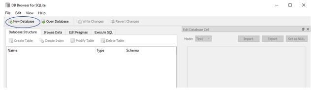
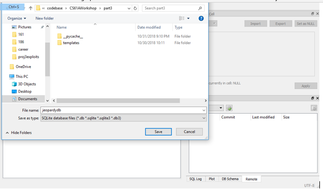
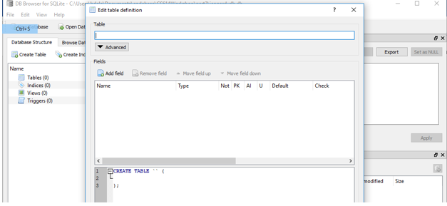
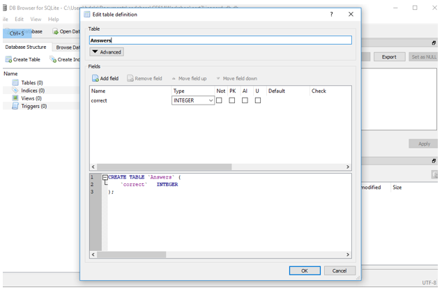
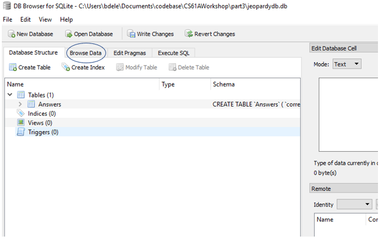
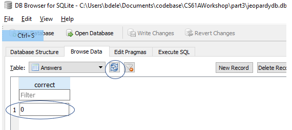

# Connecting your Flask App to a Database

## Introduction
In order for your web application to do anything useful you will need to use a database. Variables disappear if your program shuts down or your computer shuts off, so you need to store data somewhere that will keep it safe and get you what you want efficiently.

For this tutorial you can add the code to the jeopardy webapp you made during the workshop. If you get stuck, this repository has the finished version of the code I’ll go over in the document. I will not be teaching SQL in this tutorial because you will learn that in CS61A soon enough, the purpose of this is to show you how to connnect your flask app to a database.

## Step 1 - Download SQLite Browser
Download the appropriate version for your operating system from here: [SQLiteBrowser](https://sqlitebrowser.org). If you are on windows make sure you pick the correct one (probably the 64 bit version).

## Step 2 - Create the Database
Open SQLite Browser and click New Database.



Navigate to the folder that your app.py file is in and save it under whatever name you want. I called mine jeopardydb if you want to follow the tutorial exactly. SQLite saves your entire database into a file.


 
## Step 3 – Create the table
Right after you create the database a prompt should come up for creating a table. It should look like this:



Name the table Answers and create a column called correct of type integer.  Your prompt should look like this if you filled out the fields correctly:



Click Ok, and you’ve created a table!

## Step 4 – Add the boilerplate database access code

```python
import sqlite3
DATABASE = 'jeopardydb.db'

def get_db():
    db = getattr(g, '_database', None)
    if db is None:
        db = g._database = sqlite3.connect(DATABASE)
    return db

@app.teardown_appcontext
def close_connection(exception):
    db = getattr(g, '_database', None)
    if db is not None:
        db.close()
```

Copy and paste the above code into the app.py file. I won’t go into too much detail on what the code does, but it either creates a new database connection or returns the already existing one. When the app terminates the close connection function will shut down the connection. There is no way to test after this stage, just move onto step 5.

## Step 5 – Insert into the Answers table
Modify your check_answer function by adding the following lines of code right before the return statement.

```python
con = get_db()
cur = con.cursor()
if correct_answer_string == 'Correct':
    cur.execute("INSERT INTO answers VALUES (1);")
else:
    cur.execute("INSERT INTO answers VALUES (0);")
con.commit()
``` 

The first line calls the get_db() function that we added before to get a database connection. The next line returns what is called a cursor. A cursor enables us to run queries and obtain the records returned. You can use the same database connection for the life of the program, but should get new cursors for every query you run. This is why get_db() returns the connection if it is already created, but we call .cursor() to get a new cursor every time we want to run a query.

If the question is correct we want to insert a 1, else we want to insert a 0. cur.execute() executes a line of SQL, but it doesn’t save it to your database. That is why you need to run con.commit() - to actually save the update.

Confirm that this is working by visiting the random question page and answering a question. Then go back to your SQLite browser and click the Browse Data tab:



Then click refresh


    
Make sure there is a record corresponding to whether or not you got the answer correct.

After adding the boilerplate, every other SQL query we want to execute will follow this same pattern: get a connection, get a cursor, execute a query, and commit (if running an INSERT/UPDATE/DELETE and not just a SELECT).

## Step 6 – Add a stats route
```python
@app.route('/stats', methods=['GET'])
def get_stats():
    cur = get_db().cursor()
    cur.execute("SELECT COUNT(*) FROM Answers WHERE Correct=1;")
    correct = cur.fetchone()[0]
    cur.execute("SELECT COUNT(*) FROM Answers WHERE Correct=0;")
    incorrect = cur.fetchone()[0]

    return "Users have answered {} correctly and {} incorrectly for {:.2f}%".format(correct, incorrect, correct / (correct + incorrect))
```

We add a route the same way we did in the workshop. Then we get a cursor like we did before (combining getting the connection and a cursor in one line). Then we use the cursor to execute an SQL query. We use cur.fetchone() to get the first record returned by this statement (there will only ever be one because COUNT() combines all the rows into one). This returns a tuple with the values for each column that our query returns. Then we select the first and only column (index 0) which corresponds to how many correct/incorrect answers there are. Notice we do not have to run con.commit() because we are not updating our database so we therefore do not have to save anything. The last line returns a text response summary of the data.

## Questions?
Email bdeleonardis@berkeley.edu or ask in the slack group.
